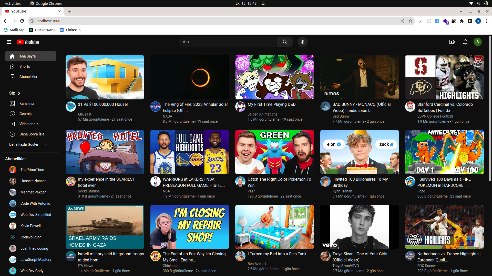

# Youtube Clone App using Next.js & Youtube Api

## Tech Stack

### Front end
- Next.js
- Tailwindcss
- Redux Toolkit
- React Icons
- React Intersection Observer Component
- Axios
- Sharp (for image optimization)
- Typescript

### Back End
- Next.js Api Routes (for structuring YouTube data api)
- Youtube V3 Data Api
- Typescript

## Features
- Popular videos list
- Infinite scrolling in home page and results page 
- Search by video, playlist, channel name
- Video Detail with description, comments and other videos
- Playlist page with playlist details and playlist item list
- Channel detail page with banner, channel info and related videos
- Responsive design

